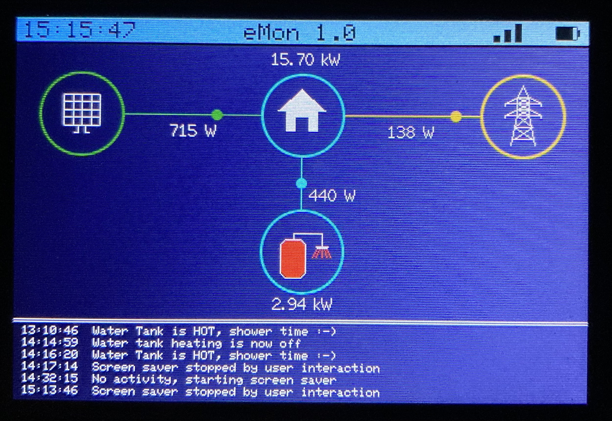
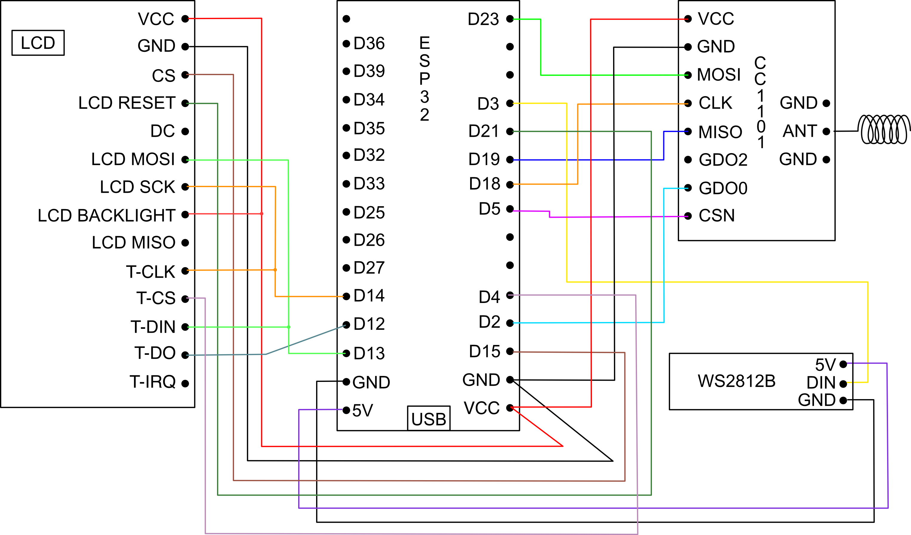
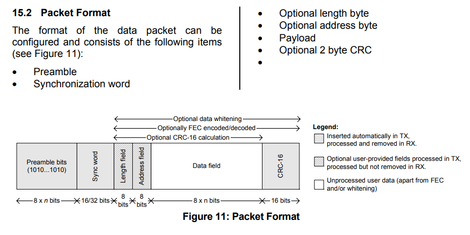
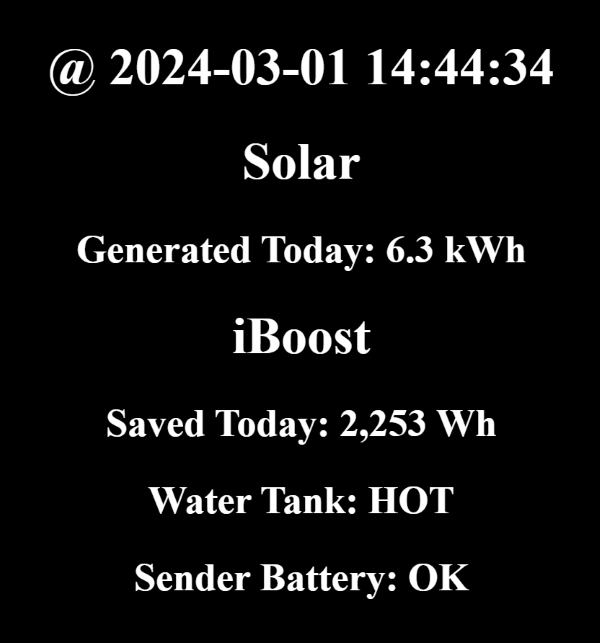

Currently in development. 

# iBoost Monitor

This project is only possible because of the work done by the following:
- Original [RTL_433 issue](https://github.com/merbanan/rtl_433/issues/1739) to decode Marlec Solar iBoost.
- Protocol analysis by [David Crocker](https://miscsolutions.wordpress.com/2022/10/02/home-energy-management-system-part-2-hacking-the-iboost-protocol/).
- ESPHome solution of the above by [JMSwanson / ESP-Home-iBoost](https://github.com/JNSwanson/ESP-Home-iBoost). 

[Marlec iBoost](https://www.marlec.co.uk/product/solar-iboost/) Monitor 

This project uses an ESP32 Wroom 32 (AliExpress) and a [CC1101 TI radio module](https://www.ti.com/lit/ds/symlink/cc1100.pdf) from eBay and a [3.5" SPI serial LCD module](https://www.aliexpress.us/item/1005001999296476.html) also from AliExpress.  The [3D case](https://www.thingiverse.com/thing:4947913) for this project was printed by my son-in-law.  The code was written in VSCode and the PlatformIO plug-in, using the PubSubClient library for MQTT connectivity, TFT_eSPI for graphics, and the same local radio library as JMSwanson as it works.  Also uses ArduinoJson for formatting MQTT messages and the Adafruit NeoPixel library for controlling the WS2812B LEDs to give a visual indication of radio traffic and any errors.

The main part of the display is based on the home assistant power flow card.  I did origionally have icons on the screen and moving arrows for the flows but feel that this visualisation is a lot easier on the eyes.  After 15 minutes of inactivity (no logging has occured) a Matrix inspired screen saver is displayed to save burn out on the screen.  As the water heats up the colour of the screen saver text changes to give a visual indication to us of when the water is hot.  

The screen I am using doesn't come with a backlight pin to turn it off/on, it's powered by 3.3v.  To get round this I would need an extra component I can control to turn the power on/off to the backlight - something to look at possibly in the furture.  I read messages via MQTT (Raspberry Pi 4) which provide me with the solar PV currently being generated and how much solar has been generated that day (via RS485 from the inverter to the Pi) which I also display on the LCD.  Additionally, I send the following information via MQTT to the Pi for inclusion on our website via crontab every 15 minutes through a Python script; PV used to heat the water tank today, status of the water tank (off, heating by solar, or hot) and the state of the CT sender's battery (this is located in the electricity meter box).

## Screenshot
Not in it's case yet.


## freeRTOS 
TASKS:
- Display task; this handles all visualisation from anination to the (matrix inspired) screen saver.
- WS2812B task; flash an led when the CC1101 receives a packet, transmits a packet and when there is an error.
- MQTT & WiFi task; periodically check that MQTT broker is running and we're connected to WiFi.
- Receive task; handle all packets received by the CC1101 transceiver.
- Transmit task; transmits a packet to the iBoost main unit (pretending to be the iBoost buddy) every 10 seconds requesting details stored in the iBoost unit.

QUEUES:
- WS2812B queue; passes what LED to flash to the WS2812B task.
- Main queue; passes information to the display task for it to update the display.

RINGBUFFER:
- Using a ringbuffer to send messages to the logging (cLog) for displaying in the logging area of the display by the display task.

## Wiring 
Wiring diagram provided by my [wife](https://www.redbubble.com/people/quirkytales/shop?artistUserName=quirkytales&collections=1925754&iaCode=all-departments&sortOrder=relevant).



## Frequency tuning

The CC1101 modules can be a little off with the frequency.  This affects the quality of the received packets and can dramatically decrease the range at which you can receive packets from the iBoost.
You can buy a better Xtal like an Epson X1E0000210666 from Farnell (2471832), or change the frequency in initialisation. For my module I needed to set the frequency to 838.35MHz, I wasn't prepared to do any SMD soldering!

Below are some suggested values.  The default is/should be 868300000 Hz.

|    Freq   | Dec     | HEX    |
|:---------:|---------|--------|
| 868425000 | 2188965 | 2166A5 |
| 868400000 | 2188902 | 216666 |
| 868375000 | 2188839 | 216627 |
| 868350000 | 2188776 | 2165E8 |
| 868325000 | 2188713 | 2165A9 |
| *868300000* | *2188650* | *21656A* |
| 868275000 | 2188587 | 21652B |
| 868250000 | 2188524 | 2164EC |
| 868225000 | 2188461 | 2164AD |
| 868200000 | 2188398 | 21646E |
| 868175000 | 2188335 | 21642F |


To make these changes you will need to change these lines:
```
radio.writeRegister(CC1101_FREQ2, 0x21);
radio.writeRegister(CC1101_FREQ1, 0x65);
radio.writeRegister(CC1101_FREQ0, 0x6a);
```

Look at the LQI value in the debug output for an indication of received packet quality, lower is better.  

When looking at the debug output of the received packets are printed. The third byte represents the source of the packet:
- 01 - Clamp sensor / sender
- 21 - iBoost Buddy sending a request
- 22 - iBoost main unit metrics data

You should optimize receive quality for the iBoost main unit (0x22). I don't have in iBoost Buddy so I never saw any of those packets.

## CC1101 Packet Format



## Website

Screenshot of the current website view .  Only needs to be a simple display, it's just for us to view if we're out and want to know if we need to heat the hot water (via HIVE) for showers etc.



## ESP32 Wroom 32 Pinout


## Development Tasks

- Recieve/transmit packets and extract iBoost information - Done
- Convert to freeRTOS - Done
- Add WS2812B LEDs to have multiple LEDs to convey messages - Done
- Feed data to existing MQTT queue on the Raspberry Pi - Done
- Raspberry Pi - Write information to website (and possible InfluxDb) - Website complete, InfluxDb not bothering with.
- Use Lilygo TTGO (ESP32-S3 with a display)/add a display - TTGO works but to small - Done
- Purchased this [3.5 inch SPI serial LCD module]() to display iBoost information and solar information currently displayed by a Lillyo TTGO. 
- Turn off/on power to the LCD backlight via a GPIO - TODO (possibly)
- Use Barr Group [C coding standards](https://barrgroup.com/sites/default/files/barr_c_coding_standard_2018.pdf)